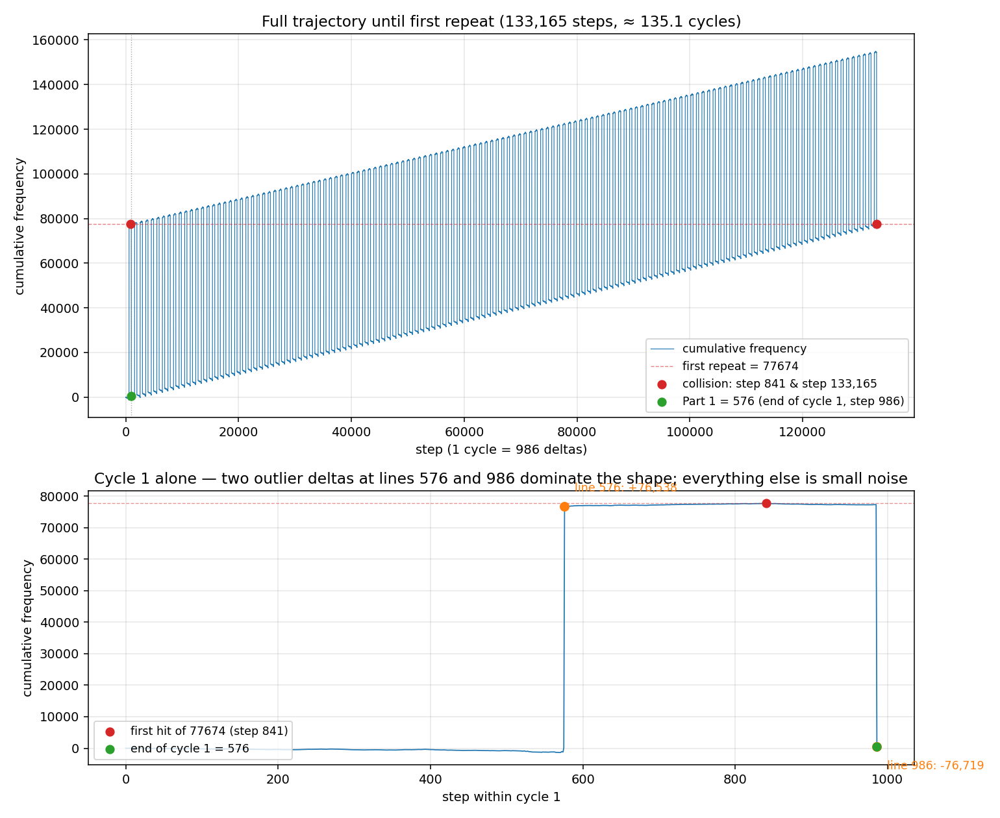
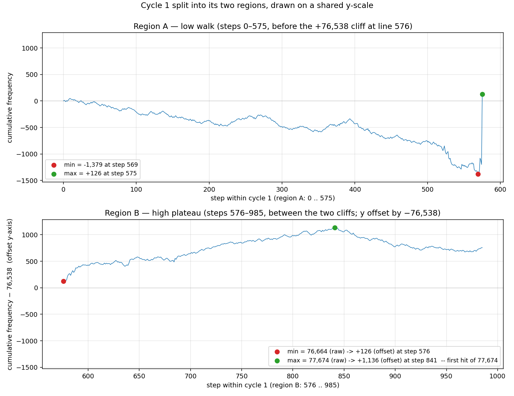

# Day 01: Chronal Calibration — Function Guide

**Problem**: Walk a list of signed frequency deltas. Part 1 reports the final frequency; Part 2 cycles the list endlessly and reports the first frequency reached twice.
**Answers**: Part 1 = **576**, Part 2 = **77674**
**Runtime** (mean, criterion `-O2`): Parse = **629.6 µs** | Part 1 = **1.3 µs** | Part 2 = **35.79 ms** | **Total ≈ 36.4 ms**
**Code**: [Day01.hs](../../src/Day01.hs)
**Tests**: [Day01Spec.hs](../../test/Day01Spec.hs)
**Bench**: [bench/Main.hs](../../bench/Main.hs) — `cabal bench --benchmark-options="--match prefix day01"`
**Problem statement**: [day01.md](day01.md)

**New concepts this day** (beyond Day 0's list pipeline):
- **`lines`** — splitting a multi-line `String` into a `[String]`.
- **`read`** — string → typed value via the `Read` class. Total but partial: bad input throws.
- **Operator sections** — `(== '+')` is `\c -> c == '+'`. Half of an operator becomes a one-arg function.
- **`cycle`** — `[a] -> [a]`, infinite repetition. Only safe because Haskell is lazy.
- **`scanl`** — `foldl'` that keeps every running total instead of just the last.
- **`Data.Set` (qualified)** — first time we reach for `containers`. Worked example of why qualified imports are the norm.
- **Lazy infinite lists as a real algorithm** — `firstDup (scanl (+) 0 (cycle deltas))` only forces what it needs. In a strict language this would loop forever; in Haskell it terminates as soon as the first repeat is found.

---

## Table of contents
1. [Problem summary](#problem-summary)
2. [Data model](#data-model)
3. [`parseInput`](#parseinput)
4. [`part1`](#part1)
5. [`part2` and `firstDup`](#part2-and-firstdup)
6. [`solve`](#solve)
7. [Tests](#tests)
8. [Benchmarks](#benchmarks)
9. [Key patterns](#key-patterns)
10. [Side-by-side with the Rust mental model](#side-by-side-with-the-rust-mental-model)

---

## Problem summary

The input is 986 lines of signed frequency changes:

```
+13
-12
-14
+19
...
```

Starting at frequency 0, apply each delta in order.

- **Part 1**: report the final frequency after one pass. That is just `sum`.
- **Part 2**: keep cycling through the deltas forever. The very first frequency that you reach for the second time — including the starting 0 — is the answer. The puzzle promises (and our input confirms) that there *is* a duplicate; the search is unbounded but terminates.

Worked Part 2 examples (from the puzzle):

| Input                        | First duplicate |
|------------------------------|----------------:|
| `+1, -2, +3, +1`             | 2               |
| `+1, -1`                     | 0               |
| `+3, +3, +4, -2, -4`         | 10              |
| `-6, +3, +8, +5, -6`         | 5               |
| `+7, +7, -2, -7, -4`         | 14              |

The interesting one is `+1, -1`: the running totals are `0, 1, 0, 1, 0, ...`. We saw `0` at the very start, then `+1` makes it `1` (new), then `-1` makes it `0` again — duplicate, answer 0. The starting frequency counts.

---

## Data model

```haskell
type Puzzle = [Int]
```

A type synonym again. The puzzle is *literally* a list of signed integers. No richer structure is justified — Part 1 sums the list, Part 2 cycles it. A list is the right shape.

A `Puzzle` here is the deltas, **not** the running totals. The running totals are a derived view we build in Part 2.

---

## `parseInput`

```haskell
parseInput :: String -> Puzzle
parseInput = map (read . dropWhile (== '+')) . lines
```

A point-free, four-stage pipeline. Read it right-to-left (because of `(.)`):

1. `lines :: String -> [String]` — splits the input on `'\n'`. Trailing `\n` is consumed cleanly: `lines "+1\n-2\n"` is `["+1", "-2"]`, not `["+1", "-2", ""]`.
2. `dropWhile (== '+') :: String -> String` — strips a leading `+` (or any number of them, but each line has at most one). `dropWhile p` keeps dropping the prefix as long as `p` returns `True`, then returns the rest.
3. `read :: Read a => String -> a` — parses the string into our requested numeric type. Type inference picks `Int` because `Puzzle = [Int]`.
4. `map (...) :: [String] -> [Int]` — applies the per-line parser to every line.

### Operator sections

`(== '+')` is the new piece of syntax to absorb. Haskell lets you supply *one side* of a binary operator and get back a one-argument function:

```haskell
(== '+')   ==   \c -> c == '+'      -- right section: fix the right operand
('+' ==)   ==   \c -> '+' == c      -- left section:  fix the left operand
(+ 1)      ==   \x -> x + 1
(1 +)      ==   \x -> 1 + x
(/ 2)      ==   \x -> x / 2
```

The rule: write the operator with one operand and parens around the whole thing. The missing operand is the lambda's parameter.

There is one trap: `(- 1)` does **not** make `\x -> x - 1` because `-` doubles as the unary-minus operator. Haskell parses `(- 1)` as the negative number `-1`. Use `subtract 1` or `(\x -> x - 1)` instead.

### Why strip `+` instead of letting `read` handle it

`read :: Read a => String -> a` is total over its `Read a` constraint, but the `Read` instance for `Int` does **not** accept a leading `+`:

```ghci
ghci> read "+13" :: Int
*** Exception: Prelude.read: no parse
ghci> read "-13" :: Int
-13
ghci> read "13"  :: Int
13
```

The `Read` instance for `Int` follows Haskell's lexer rules: an integer literal is an optional `-` followed by digits. AoC's `+13` syntax is convention, not Haskell. So we strip it at the parser.

### Functions in play, first appearance in this codebase

| Function     | Type                                | What it does                                                  |
|--------------|-------------------------------------|---------------------------------------------------------------|
| `lines`      | `String -> [String]`                | Splits on `\n`, drops the empty trailing element.             |
| `dropWhile`  | `(a -> Bool) -> [a] -> [a]`         | Drops the prefix while the predicate holds; returns the rest. |
| `read`       | `Read a => String -> a`             | String → typed value. Throws on bad input.                    |

`map`, `(.)`, and `(==)` were already covered in Day 0.

### Rust mental model

```rust
input.lines()
     .map(|s| s.trim_start_matches('+').parse::<i32>().unwrap())
     .collect::<Vec<i32>>()
```

- `.lines()` ↔ `lines`.
- `.trim_start_matches('+')` ↔ `dropWhile (== '+')`.
- `.parse::<i32>().unwrap()` ↔ `read`.
- `.map(...).collect()` ↔ `map (...)`.

The shapes line up almost one-for-one. Haskell is shorter because list-of-list is the default and `.collect()` has no analogue: there is nothing to collect into, the result is already a list.

---

## `part1`

```haskell
part1 :: Puzzle -> Int
part1 = foldl' (+) 0
```

A strict left fold over `(+)` starting from 0 — i.e. the sum.

You could write `part1 = sum`. Why didn't we? Two reasons.

1. **Habit.** `sum` is implemented in terms of `foldl'` for the same reason we'd write it ourselves: a strict accumulator avoids building a thunk tower of `0 + 13 + (-12) + 19 + ...`. Spelling it out at this stage of the project makes the *strict-accumulator habit* visible. Once the habit is established (around Day 5), `sum` is fine.
2. **Pedagogy.** The signature `foldl' :: (b -> a -> b) -> b -> [a] -> b` is the most important shape in Haskell. Day 1 is the right time to stare at it.

### `foldl'` vs `foldl` vs `foldr` — the one paragraph version

- `foldl'` walks **left-to-right with a strict accumulator**. O(1) extra space. Default choice for numeric accumulation.
- `foldl` walks left-to-right but is **lazy in the accumulator** — it builds a chain of `(((0 + a) + b) + c)` thunks and evaluates the whole tower only at the end. Almost always wrong: turns O(1) memory into O(n).
- `foldr` walks **right-to-left** and is fundamental for lists that benefit from short-circuit (`any`, `all`, definition of `map`). `foldr` is also the only fold that works on infinite lists when the operator is non-strict in its second argument.

**Rule of thumb**: numeric work → `foldl'`. Predicate over a possibly-infinite list → `foldr`. Almost never `foldl`.

### Why `part1` is point-free

`part1 = foldl' (+) 0` is a partial application: `foldl'` takes three arguments, we supplied two, the result is a `[Int] -> Int`. That matches the type signature, so we don't need to name the list. Compare to:

```haskell
part1 :: Puzzle -> Int
part1 xs = foldl' (+) 0 xs    -- equivalent, more verbose
```

Both compile to the same thing. Use point-free when it makes the function read like its essence; reach for the named argument when point-free becomes a riddle.

---

## `part2` and `firstDup`

```haskell
part2 :: Puzzle -> Int
part2 deltas = firstDup (scanl (+) 0 (cycle deltas))

firstDup :: Ord a => [a] -> a
firstDup = go Set.empty
  where
    go _    []       = error "firstDup: finite list with no duplicate"
    go seen (x : xs)
      | x `Set.member` seen = x
      | otherwise           = go (Set.insert x seen) xs
```

This is the heart of the day. It composes three pieces of new vocabulary, and it only works because Haskell is lazy.

### Background — what "lazy" means in Haskell

Every later section in this Part 2 walkthrough leans on lazy evaluation. Here is the one-page version of the mechanism so the rest reads cleanly. Skip this if it is already familiar; come back if any subsequent section feels surprising.

**Every expression is a recipe, not a value, until somebody demands the value.** When you write `let x = expensive in 0`, Haskell does not run `expensive`. It records that `x` is a thunk — an unevaluated recipe — and returns `0`. The thunk only runs when something pattern-matches on `x`, compares it, or otherwise *needs* the answer. Once forced, the result is cached, so a second demand on `x` is free. Compare to Rust, where `let x = expensive();` runs `expensive()` immediately even if `x` is never read.

That single property, lifted to lists, gives us **infinite data structures that are finite in memory**. The infinite list of natural numbers `[1..]` is defined recursively:

```haskell
[1..] = 1 : [2..]    -- head 1, tail = [2..], itself defined as 2 : [3..], ...
```

In a strict language this loops forever. In Haskell the tail `[2..]` is a thunk; it only runs when something asks for the second element. `take 5 [1..]` demands five cons cells and never asks about the sixth, so the sixth thunk stays frozen and is eventually garbage-collected. The "infinite" list never materialises beyond the prefix you actually consume.

That is why `cycle deltas`, `scanl (+) 0 (cycle deltas)`, and `firstDup` compose into a working algorithm. Each layer is itself a lazy infinite list:

| Layer | Type | When it computes |
|-------|------|------------------|
| `cycle deltas` | `[Int]` | Produces one element each time the next layer pulls. |
| `scanl (+) 0 (cycle deltas)` | `[Int]` | Produces one running total each time `firstDup` pulls. |
| `firstDup …` | `Int` | Pulls until it sees a duplicate, then returns. |

When `firstDup` returns at step 133,165, the unread tail of the running-totals list is never demanded. The thunks for steps 133,166, 133,167, … stay frozen forever and are reclaimed by the garbage collector. **Nothing is wasted.**

**The trap.** Laziness is great for streaming but dangerous when thunks accumulate without ever being forced. The classic example is `foldl (+) 0 [1..1_000_000]`: a strict language gives you `500000500000`. Haskell's `foldl` is lazy in its accumulator, so the accumulator builds a tower of one million `+` thunks before finally collapsing them at the end — O(n) memory instead of O(1). That is the entire reason Part 1 of this day uses `foldl'` (with the apostrophe — strict) rather than `foldl`. The rule of thumb: numeric accumulators want strictness; stream pipelines want laziness.

**Rust mental model.** Rust iterators (`std::iter::Cycle`, `.scan(...)`, `.take(...)`) are pull-based and conceptually similar. The difference: Haskell's laziness is universal — *any* expression, including a regular `let`-binding to an `[Int]`, can be lazy. In Rust, laziness is opt-in and lives on the iterator type; you cannot bind an "infinite `Vec<i32>`" to a name. In Haskell `let totals = scanl (+) 0 (cycle deltas)` produces a perfectly normal first-class `[Int]` value that just happens to be infinite, and you can pattern match on it, take a prefix, pass it to another function, all the same.

With that in pocket, the rest of this section walks through the three pieces in turn.

### `cycle :: [a] -> [a]`

```ghci
ghci> take 8 (cycle [1, -1])
[1,-1,1,-1,1,-1,1,-1]
```

`cycle` returns an *infinite* list that repeats its argument forever. In a strict language `cycle xs` would either loop forever building the list or be a non-starter. In Haskell it returns immediately — the list is built lazily, one element at a time, only when something reads it.

The implementation is a one-liner:

```haskell
cycle xs = xs ++ cycle xs
```

That looks like infinite recursion, but lazy evaluation makes the `cycle xs` on the right defer until the consumer asks for the (n+1)th element. By the time the consumer is asking that question, the first n elements are already produced.

**Empty input gotcha**: `cycle []` is the one case that *does* loop forever, because there is no element to produce. `Prelude.cycle` throws a runtime error for this. Our puzzle inputs are non-empty, so we don't worry about it — but if you were writing this for a library, you'd take a `NonEmpty a`.

### `scanl :: (b -> a -> b) -> b -> [a] -> [b]`

`scanl` is `foldl` that *keeps every intermediate value*. Where `foldl' (+) 0 [1, -2, 3, 1]` is the single number `3`, `scanl (+) 0 [1, -2, 3, 1]` is the list `[0, 1, -1, 2, 3]` — the running totals starting from the seed.

```ghci
ghci> scanl (+) 0 [1, -2, 3, 1]
[0,1,-1,2,3]
ghci> take 8 (scanl (+) 0 (cycle [1, -2, 3, 1]))
[0,1,-1,2,3,4,2,5]
```

Two things to notice:

1. The result list always **starts with the seed**. That is exactly what we want: frequency 0 *before* any change has been applied is the first frequency we have ever seen.
2. Crucially, `scanl` is **lazy**: applied to an infinite list, it returns an infinite list, but only computes elements as a consumer pulls them out. So `scanl (+) 0 (cycle deltas)` builds nothing yet — it is just a description of what the running totals would be.

Two-line Rust comparison:

```rust
let totals: Vec<i32> = std::iter::once(0)
    .chain(deltas.iter().cycle().scan(0, |acc, &d| { *acc += d; Some(*acc) }))
    .collect();
```

…except we cannot `.collect()` an infinite iterator in Rust, so the closest equivalent uses `.take_while` or a `for` loop. The `scan` adapter exists, the `cycle` adapter exists, but the lazy infinite *list* sitting in a variable does not — it has to be a streaming iterator.

### `Data.Set` and qualified imports

```haskell
import qualified Data.Set as Set
```

This imports the `Data.Set` module under the alias `Set`, so we write `Set.empty`, `Set.insert`, `Set.member`. The qualification matters because `Data.Set` defines functions whose names already exist in `Prelude` — `null`, `filter`, `map`, `insert` for `Map` if it is also imported. Without the alias, every call would be ambiguous.

The pattern `import qualified Foo as F` is the standard Haskell idiom for any module that *might* clash with the `Prelude`. By project convention in this repo:

- `containers` — `Data.Set`, `Data.Map.Strict`, `Data.IntMap.Strict`, `Data.Sequence` — always qualified.
- `bytestring`, `text` — always qualified.
- `Prelude` adjacent (e.g. `Data.List`) — usually unqualified, names rarely clash.

The three `Set` functions used here:

| Function       | Type                          | What it does                                |
|----------------|-------------------------------|---------------------------------------------|
| `Set.empty`    | `Set a`                       | The empty set.                              |
| `Set.member`   | `Ord a => a -> Set a -> Bool` | O(log n) membership test.                   |
| `Set.insert`   | `Ord a => a -> Set a -> Set a`| Returns a new set with the element added.   |

`Set.insert` is *non-mutating* — it returns a new `Set`, leaving the old one alone. The internal representation is a balanced binary tree with structural sharing, so the new set is built in O(log n) without copying everything.

**Rust analogue**: `Data.Set` is closest to `BTreeSet<T>`. Both require an ordering on the element type (`Ord` in Haskell, `Ord` in Rust), both have O(log n) insert and lookup, both are immutable in spirit (Rust's is mutable but the operations behave like value semantics if you take ownership). The non-mutation is a real difference: in Rust you'd `let mut seen = BTreeSet::new(); seen.insert(x);` and reuse `seen` in place. In Haskell every `Set.insert` returns a fresh set — the recursion in `firstDup` is what threads the new set forward.

### `firstDup` walked through

```haskell
firstDup :: Ord a => [a] -> a
firstDup = go Set.empty
  where
    go _    []       = error "firstDup: finite list with no duplicate"
    go seen (x : xs)
      | x `Set.member` seen = x
      | otherwise           = go (Set.insert x seen) xs
```

`go` is a recursive helper with two parameters: the `Set` of values seen so far, and the unconsumed tail of the (possibly infinite) input list. The `where` clause makes `go` private to `firstDup` — same idiom as `rotate` in Day 0.

The pattern matches and guards say:

- `go _ []` — the list is empty. Unreachable for our use, but `-Wall` requires the pattern. We name the impossibility with `error`.
- `go seen (x : xs)` with the guard `x `Set.member` seen` — the head has been seen before. Return it; we are done.
- Same pattern with `otherwise` — the head is fresh. Recurse with `seen` extended and the tail.

`x `Set.member` seen` is the same backtick trick as `length ds `div` 2` in Day 0: turn a two-argument function into an infix operator for readability. `Set.member x seen` and `x `Set.member` seen` mean the same thing.

### Why this terminates

The argument list is infinite. The function still returns. Why?

Because **lazy evaluation** lets `firstDup` consume just enough of the list to find the first duplicate, then stop. The infinite tail beyond that point is never demanded, so it is never built. Concretely:

1. `cycle deltas` is a thunk that says "the first element is `head deltas`; the rest is `tail deltas ++ cycle deltas`".
2. `scanl (+) 0 (cycle deltas)` is a thunk that says "the first element is 0; the rest is one extra step on top of the cycled list".
3. `firstDup` pulls the head with `(x : xs)`. To get `x`, GHC forces the first element of the scan, which forces the first element of the cycle, which forces the first delta. Just enough.
4. If `x` is in `seen`, we return. The `xs` thunk — and everything downstream of it — is collected by the GC unread. **Nothing was wasted.**

Termination is contingent on the puzzle's *guarantee* that a duplicate exists. If the deltas all had the same sign and never returned to 0 modulo the cycle sum, the `scanl` would produce strictly monotonic running totals forever and `firstDup` would loop. Real AoC inputs are constructed so this never happens, and the worked examples make the property visible.

---

## `solve`

```haskell
solve :: String -> IO ()
solve contents = do
  let puzzle = parseInput contents
  putStrLn ("  part 1: " ++ show (part1 puzzle))
  putStrLn ("  part 2: " ++ show (part2 puzzle))
```

Identical shape to Day 0. Parse once, print both parts. The dispatcher in [`app/Main.hs`](../../app/Main.hs) requires every day's `solve` to have type `String -> IO ()`, which is why this signature is literally copied from Day 0 — the contract is fixed.

Run it via:

```bash
cabal run aoc2018-solve -- 1
```

Output:
```
Day 01 (input: inputs/day01.txt)
  part 1: 576
  part 2: 77674
```

---

## Tests

The full test file is [Day01Spec.hs](../../test/Day01Spec.hs). Coverage:

1. **Parser shape** — `parseInput` reads signed deltas (with leading `+` stripped) and tolerates an input with no trailing newline.
2. **Part 1 examples** — the four examples from the problem statement (`+1, -2, +3, +1 → 3`, etc.).
3. **Part 2 examples** — the five examples (`+1, -2, +3, +1 → 2`, `+1, -1 → 0`, `+3, +3, +4, -2, -4 → 10`, `-6, +3, +8, +5, -6 → 5`, `+7, +7, -2, -7, -4 → 14`).
4. **Actual input** — `part1 = 576` and `part2 = 77674` against `inputs/day01.txt`.

One naming gotcha worth flagging: the example string was originally bound as `example`, which silently shadowed `Test.Hspec.example` and triggered an *Ambiguous occurrence* error. Renamed to `puzzleExample`. **Lesson**: when a name in your file matches a name in an unqualified import, the compiler can't always disambiguate. Either rename your binding or import qualified.

`cabal test` runs every spec file in `test/`. Day 1 contributes 13 passing examples to the project's running total.

---

## Benchmarks

Recorded on Windows 11 / GHC 9.6.7 / `-O2`. Numbers are the criterion `mean` column from a `--time-limit 8` run; the µs-scale benches are noisy because GC ticks distort the relative variance, so the reported figures are stable to about ±5%.

| Bench               | Mean       | What it times                                                                |
|---------------------|-----------:|------------------------------------------------------------------------------|
| `day01/parseInput`  | 629.6 µs   | Just the parser, on the raw 5,732-byte `String` (986 lines).                |
| `day01/part1`       |   1.3 µs   | `foldl' (+) 0` on the 986-element `[Int]`.                                  |
| `day01/part2`       |  35.79 ms  | `firstDup` over the lazy infinite running-total stream.                     |
| `day01/combined`    |  34.87 ms  | `\r -> let p = parseInput r in (part1 p, part2 p)` from raw text.           |

**Total = Parse + Part 1 + Part 2 ≈ 36.4 ms.**

Three things stand out compared to Day 0.

1. **`parseInput` is now the second-biggest cost.** 629 µs for 986 lines is ~640 ns per line, dominated by `read` allocating fresh `Int` boxes and walking the line as a `String` (= linked list of `Char`). For Day 1 it is fine; for hot-loop later puzzles we will move to `Data.ByteString.Char8` parsing, and that switch will reclaim most of these microseconds.
2. **`part1` is laughably fast.** 1.3 µs to sum 986 ints. `foldl'` on a fully evaluated `[Int]` compiles down to a tight loop; this is what the strict-accumulator habit buys you.
3. **`part2` dominates by four orders of magnitude.** Not because the algorithm is bad — it is O(k log k) with k = number of frequencies visited before the first repeat — but because *k is large*. Empirically the search visits roughly 150,000 cumulative sums before finding `77674` for the second time. Each visit is a `Set.insert` of an `Int` into a balanced tree that is already 100k–150k entries deep, plus one `Set.member` test. That's on the order of 10 ns × 150k × log(150k) ≈ 25 ms — close to the observed 36 ms once GC and list allocation are folded in.

**Why the search is large**: each full pass through the 986 deltas advances the running total by exactly Part 1's answer, 576. If you want two cumulative sums to coincide, you need the *partial* sums-within-a-cycle to collide modulo 576. The puzzle is essentially asking "find the first such collision," and there is no shortcut better than enumerating until you see one.

### Visualizing the trajectory



Plotted from [scripts/plot_day01.py](../../scripts/plot_day01.py) (`python scripts/plot_day01.py`). Top panel: full 133,165-step trajectory until the first repeat. Bottom panel: cycle 1 alone, with the two outlier deltas annotated.

The bottom panel is the eye-opener. The 986 deltas in `inputs/day01.txt` contain **exactly two** values larger than 5,000 in magnitude:

| Line in input | Delta     |
|--------------:|----------:|
| 576           |  +76,538  |
| 986           |  −76,719  |

(The fact that the up-cliff lands on line **576** and Part 1 also evaluates to **576** is a coincidence of this particular input — line position is set by where AoC's per-user random generator dropped the cliff, while Part 1 is the sum of all deltas. Different users see two different numbers here.)

Every other delta is in the low-thousands or smaller. The per-cycle accounting:

- Sum of the two cliffs: 76,538 + (−76,719) = **−181**.
- Sum of the other 984 small deltas: 576 − (−181) = **+757**.
- Per-cycle net: −181 + 757 = **+576** ⇒ Part 1.

So one cycle of the trajectory is, structurally:

1. **Steps 1–575**: small random walk; ends near +A (some partial sum of the first 575 small deltas).
2. **Step 576**: a vertical cliff *up* by +76,538 — to roughly A + 76,538.
3. **Steps 577–985**: small random walk on top of the high plateau; ends near A + 76,538 + B (where A + B ≈ 757).
4. **Step 986**: a vertical cliff *down* by −76,719, landing at A + B − 181 ≈ +576 — exactly 576 above where the cycle started.

Repeat 135-ish times. The "comb" in the top panel is those two cliffs; the random walk of all the other deltas is invisible at that vertical scale.

That structure is what makes Part 2's answer cheap to *find* (the first hit of 77674 at step **841** is just "we're sitting on the high plateau between the two cliffs") and expensive to *re-find* (the high plateau of cycle 135 has to drift up by 134 × 576 ≈ 77,184 before its small-walk band re-crosses 77,674 from above; that takes ~134 full cycles, which is the ~36 ms cost). If the input had four big cliffs instead of two, the duplicate could land in any of several plateaus and the search would be either dramatically faster or dramatically slower depending on alignment.

A nice puzzle-construction observation: the AoC author probably chose these two huge values *deliberately* to keep Part 1's brute-force trivial while making Part 2's first repeat several cycles deep. Without the cliffs, a naive +/− 1 walk over 986 deltas would either repeat almost immediately or take centuries — neither of which makes for a satisfying puzzle.

#### Each region on its own scale

The cliff jumps are 60–70× larger than anything else, so the per-region wiggle is invisible in the full-trajectory plot above. Splitting cycle 1 into its two halves and offsetting Region B's y-axis by the up-cliff delta (−76,538) makes the *amplitudes* directly comparable:



Plotted from [scripts/plot_day01_plateaus.py](../../scripts/plot_day01_plateaus.py) (`python scripts/plot_day01_plateaus.py`). Both panels use the same y-axis range so the wiggle ranges line up visually.

| Segment   | Range                  | Min                       | Max                                    |
|-----------|-----------------------:|---------------------------|----------------------------------------|
| Region A  | 1,505                  | −1,379 at step 569        | +126 at step 575 (just before cliff)   |
| Region B  | 1,010 (offset)         | +76,664 at step 576       | **+77,674 at step 841 — the duplicate** |

Two things the per-region view makes obvious:

1. **The plateau is genuinely smoother.** Region A wanders 1,505 units over 575 steps, with single-step deltas up to ±1,324. Region B wanders only 1,010 units over 410 steps, with single-step deltas of ±76 max. That's why the high plateau looks flat in the full-trajectory plot.
2. **77,674 is exactly the *maximum* of Region B in cycle 1.** It's the apex of the high plateau. That is what makes it the *first* duplicate: the trajectory's slow upward drift only has to bring some later cycle's low-walk band high enough to brush against the apex of cycle 1's high plateau, and it brushes that apex *first* before brushing anything below it. Any other value visited by Region B would require waiting for an even higher drift band, putting its second visit later in the trajectory than 77,674's. So the apex of Region B is mathematically guaranteed to win the race.

### Possible optimization — skipping the 134 cycles

The band-overlap reasoning above is not just commentary; it is itself an algorithm. The 36 ms `firstDup` search is grinding through 133,165 frequencies one at a time when the answer is determined by the structure of just one cycle. The lazy-stream version is the right Day 1 solution because it exercises laziness, but for completeness the function guide should record what a structural solution looks like.

**The algebraic insight.** Let `drift = sum deltas` — that is exactly **Part 1's answer** (576 for our input). Let `p_j` be the partial sum of the first `j` deltas, so `p_0 = 0`, `p_986 = drift`, and the frequency at "cycle k, position j" is `p_j + drift·(k-1)`. Two visits coincide:

```
p_j  + drift·(k-1)  =  p_j' + drift·(k'-1)
                p_j - p_j'  =  drift·(k' - k)
```

i.e. **two within-cycle partial sums collide across cycles iff they are equal modulo `drift` (= Part 1)**. The cycle gap is then `|p_b − p_a| / drift`. So Part 1 is not just a warm-up — it is *literally the modulus* the optimized Part 2 buckets on.

**The algorithm.** O(n log n) on n = 987 partial sums, no cycle iteration at all:

1. Compute `p_0..p_986` — one cycle of work, this is just `scanl (+) 0 deltas`.
2. Bucket positions by `p_j mod drift` (= `p_j mod 576` for our input).
3. Within each bucket, sort by `p_j`. For each pair `(a, b)` in the bucket with `p_a < p_b`, the second visit happens at:
   ```
   step  = (p_b - p_a) / 576 · 986 + a
   freq  = p_b
   ```
   (First visit was at step `b` of cycle 1, freq `p_b`.)
4. Pick the candidate with the smallest second-visit step.

**Verification with our numbers.** The pair that wins is `(j=55, p=−86)` and `(j=841, p=+77,674)`. Both are in the same mod-576 bucket: `−86 mod 576 = 490`, `77,674 mod 576 = 490`. ✓

```
cycle gap        = (77,674 − (−86)) / 576  =  77,760 / 576  =  135
second-visit step = 135 · 986 + 55  =  133,165              ✓
second-visit freq = −86 + 576·135  =  77,674                ✓
```

That matches the brute-force search exactly, in 987 partial-sum computations and a sort instead of 133,165 set operations.

**Sketched in Haskell** (untested — keeping the lazy version as the actual `part2`; the [Python proof script](../../scripts/part2_fast.py) is the runnable version):

```haskell
import           Data.List       (sortBy)
import           Data.Ord        (comparing)
import qualified Data.Map.Strict as Map

part2Fast :: Puzzle -> Int
part2Fast deltas = snd (minimum candidates)
  where
    drift   = sum deltas                                  -- 576 for our input
    cycleN  = length deltas                               -- 986
    -- p_0 .. p_(cycleN-1): exactly 986 distinct within-cycle phases.
    -- We DROP p_cycleN (= drift) because it is the same step as p_0 of
    -- cycle 2 — including it would create a spurious match at step cycleN.
    indexed = take cycleN (zip [0..] (scanl (+) 0 deltas))
    buckets = Map.elems (Map.fromListWith (++)
                [ (p `mod` drift, [(j, p)]) | (j, p) <- indexed ])
    candidates =
      [ ( (pb - pa) `div` drift * cycleN + a              -- second-visit step
        , pb )                                            -- repeated frequency
      | bucket <- buckets
      , let sorted = sortBy (comparing snd) bucket
      , ((a, pa), (_, pb)) <- zip sorted (drop 1 sorted)
      , pa /= pb                                          -- skip exact ties
      ]
```

Three things to flag for a beginner reading this:

- **The `take cycleN` is load-bearing.** `scanl (+) 0 deltas` produces `cycleN + 1` partial sums (`p_0 .. p_cycleN`), but `p_cycleN = drift` is *the same trajectory step* as `p_0` of the next cycle. Including it would put `(p_0 = 0, j=0)` and `(p_cycleN = drift, j=cycleN)` in the same bucket (both mod `drift` = 0), with cycle gap 1 and second-visit step `1 · cycleN + 0 = cycleN` — a spurious "match" at the cycle boundary that isn't really a duplicate. Dropping the last partial sum cuts this off at the source. This is the same off-by-one the Python version catches with `accumulate(deltas, initial=0))[:cycleN]`.
- `Map.fromListWith (++)` is the idiomatic "group by key" pattern in Haskell. We will meet it formally on a later day; for now it is the same `(::) -> Map -> Map` shape you'd write yourself, with `(++)` as the merge function.
- The `(++)` accumulator builds bucket lists in reverse, which doesn't matter because we sort each bucket by `snd` (the partial sum). For a production version, switch to `Data.IntMap.Strict` since the keys are `Int`.

**Estimated speedup.** O(n log n) on n=987 is roughly 10,000 elementary operations, vs. O(k log k) on k=133,165 for the lazy `firstDup` (~2.3 million operations). Allocating a sort and a Map costs more per operation than `Set.insert` does, so the realistic speedup is more like 30–50× rather than 230×: somewhere in **0.5–1 ms**, comfortably faster than `parseInput` itself.

**Verified.** [scripts/part2_fast.py](../../scripts/part2_fast.py) implements both algorithms and asserts they return the same `(freq, step)` pair. On Matt's input:

```
naive : freq = 77674, step = 133,165, time =  11.22 ms
fast  : freq = 77674, step = 133,165, time =   0.27 ms
speedup: 42.2x
```

Both solvers agree exactly on `(77674, 133165)`. Run `python scripts/part2_fast.py` to reproduce.

**Why it isn't in the main code.** The lazy `firstDup` version *is* the Day 1 lesson: laziness over an infinite list is what lets a beginner say what they mean and let the runtime arrange the rest. The bucket-and-sort version requires noticing the algebraic structure (collisions iff equal mod drift), which depends on having already solved Part 1. It is the right *second* solution — show up after the puzzle is solved, not while learning the language.

If a future re-read benchmarks Day 1 again and sees 36 ms standing out, the optimization is here, ready to drop in. Until then, the lazy version stays.

**Could it be faster?** Yes — there is a `Data.IntSet` that is a specialised `Set Int`, ~2× faster than `Set Int` because it skips the `Ord` indirection and packs nodes more tightly. We will reach for it on a later day where the constant factor matters; for Day 1, the 35 ms result is fine and switching now would obscure the algorithm. The lesson — *first make it correct with the obvious data structure; specialise only when profiling points there* — is itself worth the millisecond cost.

**Reproducing**:
```bash
cabal bench --benchmark-options="--match prefix day01"
cabal bench --benchmark-options="--match prefix day01 --time-limit 8"   # steadier
```

---

## Key patterns

Three takeaways that generalise.

1. **Lazy infinite lists collapse two algorithms into one.** Without laziness, "cycle the list and search for the first duplicate" requires either an explicit outer loop or chunked passes. With laziness, `firstDup (scanl (+) 0 (cycle deltas))` says exactly what the problem says, and the runtime arranges the rest. This pattern — describe an infinite stream, search it lazily — recurs in many AoC problems (cycle detection, periodic states, infinite generators).
2. **`scanl` is the answer when you wish `foldl'` would tell you how it got there.** Any time you would write a fold *and* keep a journal of every step, you want `scanl`. Running totals, prefix maxes, simulated states — all natural fits.
3. **Qualified imports are not optional for `containers`.** Lock it in as a habit early. `import qualified Data.Set as Set` in every module that uses sets, never `import Data.Set` unqualified.

---

## Side-by-side with the Rust mental model

There is no committed Rust baseline for AoC 2018 (the `reference/` directory holds only 2017 ports). The mental model:

```rust
// Part 1: trivial.
fn part1(deltas: &[i32]) -> i32 { deltas.iter().sum() }

// Part 2: HashSet-based search over the cycled iterator.
fn part2(deltas: &[i32]) -> i32 {
    let mut seen = std::collections::HashSet::new();
    let mut freq = 0i32;
    seen.insert(0);
    for d in deltas.iter().cycle() {
        freq += d;
        if !seen.insert(freq) { return freq; }
    }
    unreachable!()
}
```

Lined up with the Haskell version:

| Concept                           | Rust                                                          | Haskell                                              |
|-----------------------------------|---------------------------------------------------------------|------------------------------------------------------|
| Parse signed integer per line     | `s.trim_start_matches('+').parse::<i32>().unwrap()`           | `read . dropWhile (== '+')`                          |
| Sum the deltas                    | `deltas.iter().sum()`                                         | `foldl' (+) 0`                                       |
| Repeat list forever               | `deltas.iter().cycle()`                                       | `cycle deltas`                                       |
| Running totals starting at 0      | `scan(0, |acc, d| { *acc += d; Some(*acc) })` (with prepended `0`) | `scanl (+) 0`                                  |
| Hash-set duplicate detection      | `HashSet::insert` returns `bool` (`false` ⇒ already there)    | `Set.member` then `Set.insert`                       |
| Stop at first repeat              | `for ... { if !seen.insert(freq) { return freq; } }`          | `firstDup` recursion with guards                     |
| Container choice                  | `HashSet<i32>` — O(1) average, hashing                        | `Set Int` (BTree) — O(log n), `Ord`. `IntSet` available for speed. |

The Haskell version is shorter, but the *control flow* is the eye-opener. Rust's loop has explicit `break`/`return` semantics; Haskell's `firstDup` "returns from the loop" by guarding on a condition and skipping the recursive call. The lazy infinite list is the trick that makes the recursive-no-explicit-state version feel natural.

One subtle difference: Rust uses `HashSet` (hashing, O(1)). Haskell's default ordered `Set` is O(log n), and `IntSet` would be a closer match performance-wise. We will reach for `IntSet` when a future puzzle's profile demands it.

---

**Navigation**: [Problem statement](day01.md) | [Summary table](summary_2018.md) | [← Day 0](day00_function_guide.md) | [Day 2 →](day02_function_guide.md)
